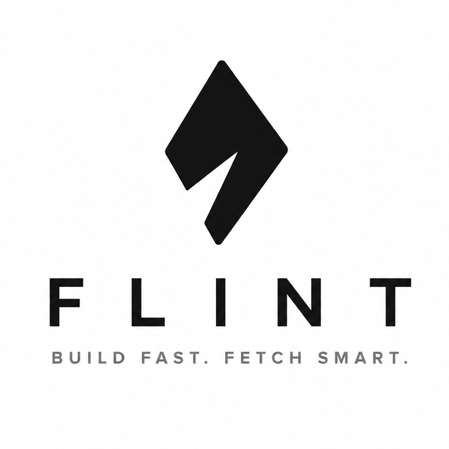

<div align="center">
  
</div>

# Flint

**Disclaimer: This project is in BETA stage and only available for Linux, use with caution.**

Flint is an experimental build system and package manager for C/C++ projects. It aims to simplify the development workflow by managing dependencies directly through Git and automating the compilation process via a single JSON configuration file.
Flint is compatible with GCC & Clang compilers.

**NOTE:** 

CLI Docs available here: [Flint](https://mainak55512.github.io/flint-cherts/)

Recipes of the dependencies are/will be updated here: [Flint Cherts](https://mainak55512.github.io/flint-cherts/compositions/)

## Project Structure

Flint expects a specific directory layout to function correctly:

* **src/**: All local project source files (.c, .cpp).
* **include/**: Local header files (.h, .hpp).
* **deps/**: External libraries (managed by Flint).
* **static/**: Contains all the static library (.a) files.
* **shared/**: Contains all the dynamic/shared (.so) libraries.
* **composition.json**: The project manifest.

## How it Works

Currently, Flint uses a "manifest-first" approach:

1. **Git Integration**: When a library is added, myBuild clones the repository into the `deps/` directory.
2. **Strict Manifest Requirement**: For a dependency to be compatible, it **must** contain its own `composition.json` file. Flint reads this file to understand which directories to include and compile. EDIT: Libraries can be added through chert compositions now (check [Flint Cherts](https://mainak55512.github.io/flint-cherts/compositions/)).
3. **Compilation**: The tool aggregates all source files and include paths from the main project and all dependencies to trigger the local compiler.

## composition.json Structure

```json
{
    "project_name": "example_project",
    "project_language": "c",
    "version": "0.1.0",
    "compiler_path": "/usr/bin/gcc",
    "executable": true,
    "flags": [],
    "lib_links": [],
    "include_paths": ["include"],
    "src": ["src"],
    "dependencies": {
        "example_lib": {
            "version": "1.0.0",
            "remote": "https://github.com/user/example_lib"
        }
    }
}

```

## Current Limitations

As this is an early development prototype, please be aware of the following:

* ~~**No Build Flags**: Custom compiler flags (e.g., -O3, -Wall) are not yet supported.~~
* **Naming Conflicts**: There is currently no resolution logic for dependencies that share the same directory or project names.
* ~~**Strict Compatibility**: Only repositories containing a `composition.json` file can be added as dependencies at this time.~~
* ~~**No Incremental Builds**: The system currently performs full builds.~~

## Build
Clone the repo
```bash
git clone https://github.com/mainak55512/flint
cd flint
chmod +x ./build.sh
./build.sh
```

## Usage

### Initialize a Project

```bash
flint init

```

### Add a Dependency

(The remote repository must contain a `composition.json` file)

```bash
flint add <git_remote_url>

```
or
Add the cherts composition in the `dependencies` section in composition.json and run
```bash
flint sync
```
**N.B.** compositions are/will be available in [Flint Cherts](https://mainak55512.github.io/flint-cherts/compositions/)

### Build

```bash
flint build

```
or directly run with
```bash
flint run
```
