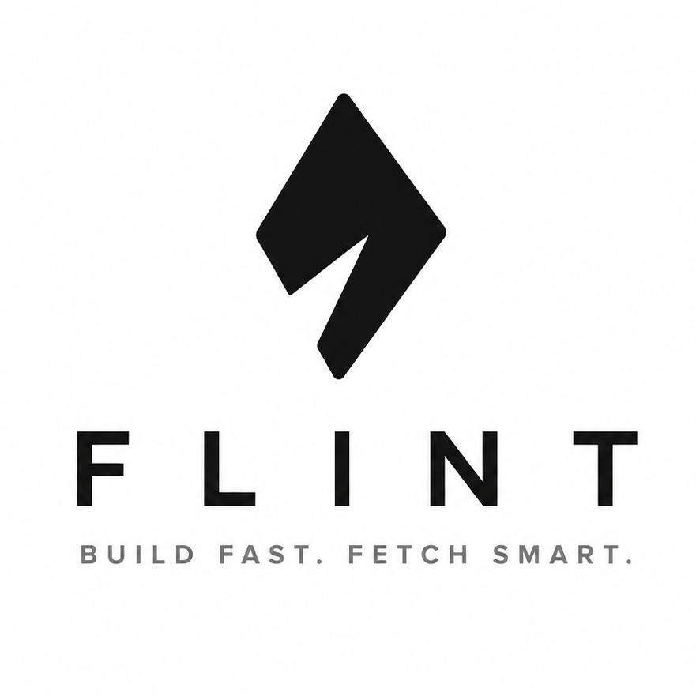

<div align="center">

<h1>Flint</h1>
<p><b>A small, Git-native build tool for C/C++. One manifest file, no CMake.</b></p>

[](#limitations-and-roadmap)
[](#install)
[](LICENSE)

[CLI Docs](https://mainak55512.github.io/flint-cherts/) · [Chert Compositions](https://mainak55512.github.io/flint-cherts/compositions/) · [Issues](https://github.com/mainak55512/flint/issues)

</div>

---

Flint builds C and C++ projects and fetches their dependencies straight from Git repositories. You describe the project in a single `composition.json` and Flint drives `gcc` or `clang` for you. There is no generator step and no runtime beyond `git` and a compiler.

Flint is written in C and builds itself with Flint (see its own [`composition.json`](./composition.json)).

<div align="center">
  
</div>

## Try it in 60 seconds

```bash
mkdir hello && cd hello
flint init                                              # creates composition.json and src/
flint add https://github.com/mainak55512/Cmap@v0.1.1   # clones into deps/, pins the commit
flint run                                               # build + execute
```

`flint add` writes the dependency into your manifest, including the exact commit hash it resolved the tag to.

## Why Flint?

- **One manifest.** Name, compiler, flags, and dependencies live in one file.
- **Git is the package source.** Any repository with a tag or commit can be a dependency. No account, no registry to publish to.
- **Commit-pinned dependencies.** Each dependency records a version (tag) and a commit `hash`, so builds do not silently change if a tag moves.
- **Source discovery by convention.** Flint finds sources, headers, and static/shared libraries in the standard directories. No file lists to maintain.
- **Incremental builds.** Flint checks whether the files are modified since the last build. If it is unchanged, flint skips compilation for that file.
- **Editor support out of the box.** Flint generates `compile_commands.json`, so clangd, Neovim, Helix, and VS Code index your code and your dependencies.
- **Small footprint.** Needs only `git` and `gcc` or `clang`. No Python, no Ninja, no CMake.
- **Version header generation.** `PROJECT_VERSION` is injected into your build, and `.h.in` templates are processed natively.

## Install

**Requirements:** `git`, and `gcc` or `clang`. Linux is the primary platform; macOS is in beta.

<!-- Download a prebuilt binary from the [Releases](https://github.com/mainak55512/flint/releases) page and verify its checksum, or build from source: -->

```bash
git clone https://github.com/mainak55512/flint.git
cd flint && ./build.sh
```

If you prefer the one-line installer, read the script first:

```bash
curl -fsSL -H "Accept: application/vnd.github.v3.raw" \
  https://api.github.com/repos/mainak55512/flint/contents/install.sh -o install.sh
less install.sh && bash install.sh
```

<!-- TODO: add checksummed release binaries and list build-from-source requirements -->

## Project layout

Flint expects a conventional layout (directory names are configurable, see the CLI docs):

```
my_project/
├── src/                # .c / .cpp sources
├── include/            # your headers
├── deps/               # dependencies (managed by Flint)
├── static/             # prebuilt static libraries (.a)
├── shared/             # prebuilt shared libraries (.so)
└── composition.json    # manifest
```

Anything listed in `exclude_dirs` is skipped during source discovery.

## The manifest

This is Flint's own manifest:

```jsonc
{
    // Project configuration
    "project_name": "flint",
    "project_language": "c",
    "version": "v0.5.5",
    "compiler_path": "clang",
    "executable": true,

    // Build flags
    "flags": ["-O3", "-fstack-protector-strong", "-D_FORTIFY_SOURCE=2", "-s"],

    // Skipped during source discovery
    "exclude_dirs": ["build"],

    // Dependencies
    "dependencies": {
        "arena": {
            "version": "v0.1.1",
            "remote": "https://github.com/mainak55512/arena",
            "hash": "b1659723d4d45a7eba5a8b12648a22f0212da17e"
        },
        "CString": {
            "version": "v0.1.1",
            "remote": "https://github.com/mainak55512/CString",
            "hash": "a58d598a907596bac876dbbaa7482d0d2a7e91cc"
        },
        "container": {
            "version": "v0.1.1",
            "remote": "https://github.com/mainak55512/container",
            "hash": "c2a3a5af3f5ebe3f63cf540073021dde24e56e38"
        },
        "yyjson": {
            "version": "0.12.0",
            "remote": "https://github.com/ibireme/yyjson",
            "hash": "8b4a38dc994a110abaec8a400615567bd996105f"
        },
        "Cmap": {
            "version": "v0.1.1",
            "remote": "https://github.com/mainak55512/Cmap",
            "hash": "5827928228c9d2c44eacbe44b4457b496554be57"
        }
    }
}
```

| Field | Meaning |
|---|---|
| `project_name` | Name of the produced artifact |
| `project_language` | `"c"` or `"cpp"` |
| `version` | Project version, exposed as the `PROJECT_VERSION` macro |
| `compiler_path` | Compiler executable to use |
| `executable` | `true` for a program, `false` for a library |
| `flags` | Flags passed to the compiler |
| `lib_links` | Extra libraries to link |
| `exclude_dirs` | Directories ignored during source discovery |
| `dependencies` | Map of name to `version` (tag/branch), `remote` (Git URL), `hash` (exact commit) |


## Template headers

Flint turns a *.h.in template into a header by replacing @KEY@ placeholders with the values in the manifest's tmpl block.

`include/config.h.in:`

```c
#define APP_NAME "@APP_NAME@"
#define HAVE_STRLCPY @HAVE_STRLCPY@
#define SIZEOF_LONG @SIZEOF_LONG@
```

`composition.json:`

```jsonc
{
    "tmpl": {
        "APP_NAME": "myapp",
        "HAVE_STRLCPY": "0",
        "SIZEOF_LONG": "8"
    }
}
```

`Generated include/config.h:`

```c
#define APP_NAME "myapp"
#define HAVE_STRLCPY 0
#define SIZEOF_LONG 8
```
<!-- TODO: verify the exact key name, output location, whether values must be strings, and whether PROJECT_VERSION is available inside templates -->

Because values are fixed in the manifest, Flint does not detect them for you. If a library needs different values on different systems, you set them yourself.


## Using libraries that don't have a `composition.json`

Most existing C/C++ libraries were not written for Flint. For those, Flint uses **chert compositions**: a `composition.json` maintained separately in the [flint-cherts](https://github.com/mainak55512/flint-cherts) repository that tells Flint how to build the library from source.

Be aware of what this means:

- It works best for libraries that are plain source trees: no code generation, no `configure` step, no platform probing.
- Flint can generate headers from templates: it turns config.h.in into config.h by substituting @VARIABLE@ placeholders, the same convention autotools and CMake use. Libraries that only need a templated config header can work. Values are declared as key/value pairs in the tmpl block of the manifest. See Template headers.
- flint-cherts is a community-maintained list of recipes, so in practice it plays the role of a small registry. Dependencies themselves still come from Git.

<!-- TODO: state how many cherts exist today and show one non-trivial example (e.g. zlib or sqlite) -->

**Use something else if** you need Windows, a large package ecosystem, binary caches, IDE-generated projects, or complex conditional builds. **Flint fits** small to medium projects where the build is "these sources plus these Git dependencies" and you want to stop maintaining build scripts.

## Limitations and roadmap

Honest status of the beta:

- Platforms: Linux and macOS only. No Windows.
- Cross-compilation: not first-class. You can point `compiler_path` at a cross compiler and pass flags.
- Build profiles: a single `flags` list; no separate debug/release profiles yet.
- Conditionals: no per-platform or per-option settings in the manifest.
- Targets: one artifact per manifest.
- Tests and install targets: not built in.
- Build performance: Builds are incremental.
- Auto-discovered `static/` and `shared/` libraries are linked as found, so keep those directories clean.

Planned: 

- [ ] Support for windows
- [ ] Support for separate platform configurations
- [ ] Support for separate build profiles
- [ ] Support for test executions

Feedback on which of these matters most is the most useful contribution right now.

## Contributing

- Report bugs and request features in [Issues](https://github.com/mainak55512/flint/issues).
- Add a library by writing a chert composition: see the [flint-cherts guide](https://github.com/mainak55512/flint-cherts) and open a pull request.
- Libraries built with Flint can be added by anyone with `flint add <repo_url>@<version>`.

## License

MIT. See [LICENSE](LICENSE).
